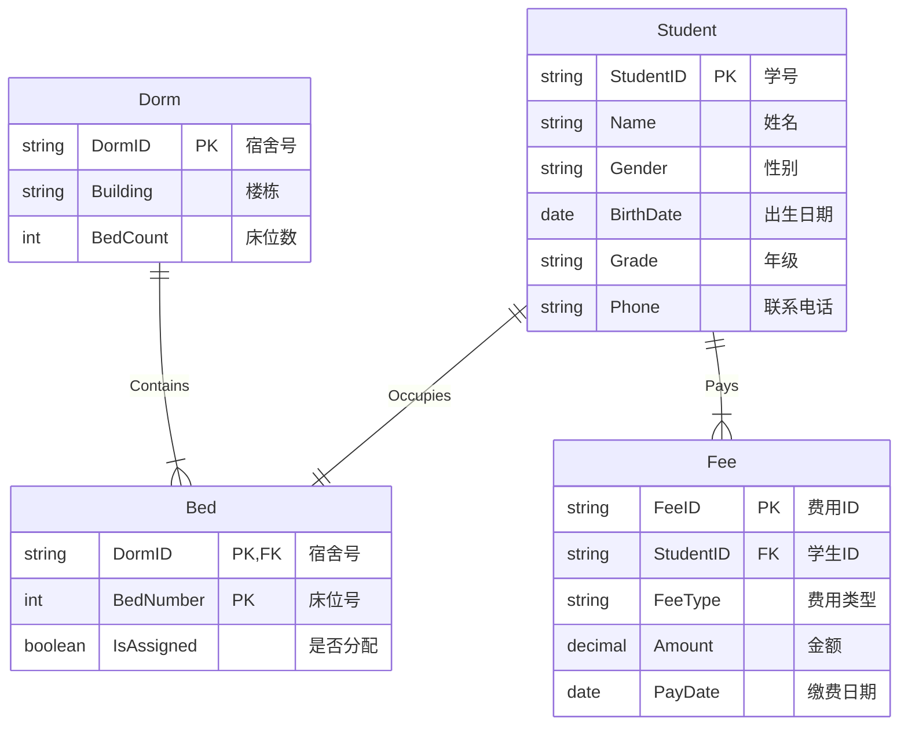
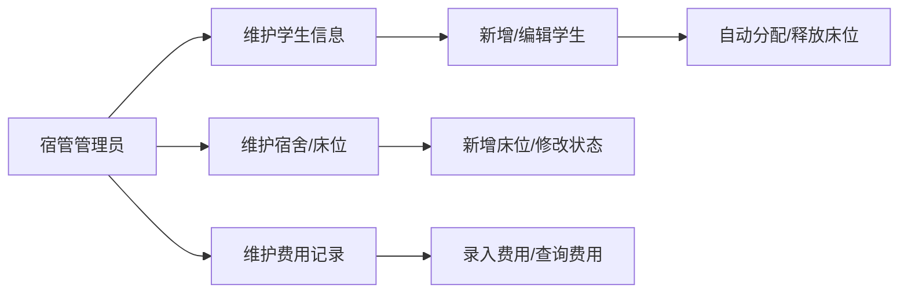
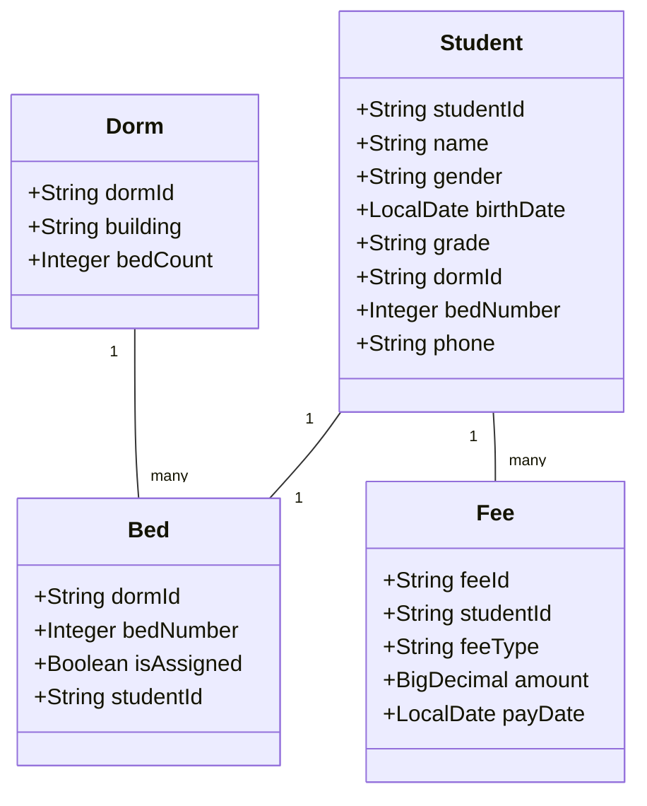
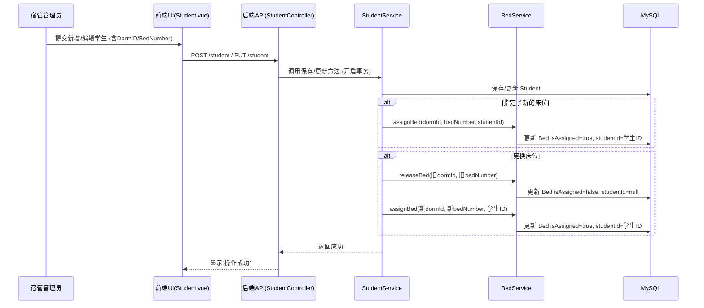
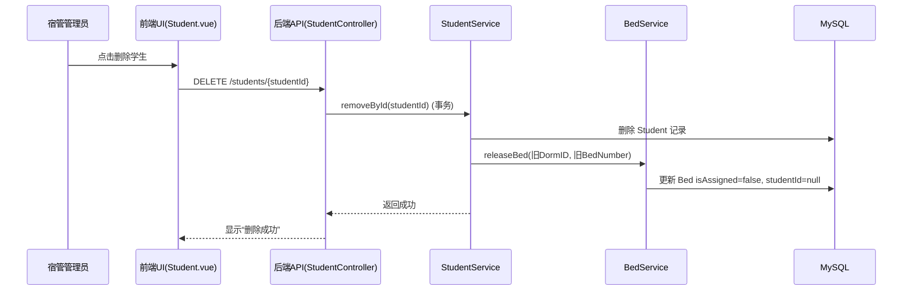
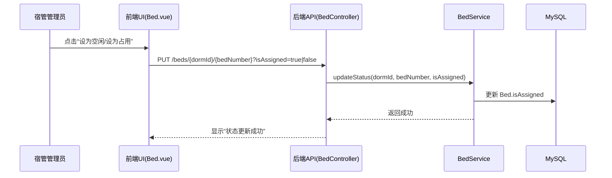
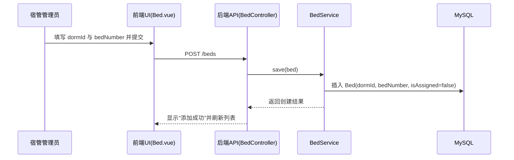
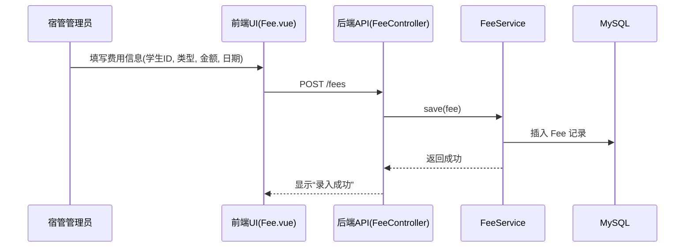
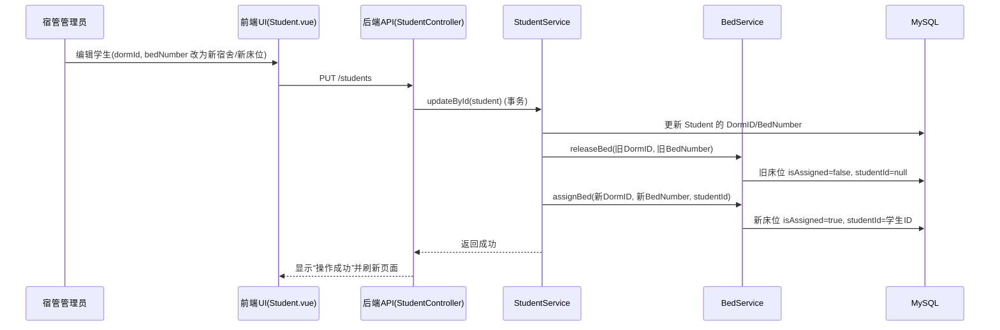

# 宿舍管理系统数据库设计报告

## 1. 概念结构设计 (E-R 图)

本系统主要用于学校宿舍管理，涉及的主要实体包括**学生 (Student)**、**宿舍 (Dorm)**、**床位 (Bed)** 和 **费用 (Fee)**。

### 1.1 实体与属性定义

1.  **学生 (Student)**
    *   **描述**: 住校的学生主体。
    *   **属性**: 学号 (StudentID, 主键)、姓名 (Name)、性别 (Gender)、出生日期 (BirthDate)、年级 (Grade)、联系电话 (Phone)。
2.  **宿舍 (Dorm)**
    *   **描述**: 宿舍楼中的房间单元。
    *   **属性**: 宿舍号 (DormID, 主键)、所属楼栋 (Building)、床位数 (BedCount)。
3.  **床位 (Bed)**
    *   **描述**: 宿舍内的具体床位，是学生入住的最小单元。床位是一个**弱实体**，它必须依赖于宿舍存在。
    *   **属性**: 床位号 (BedNumber)、是否已分配 (IsAssigned)。
    *   **标识符**: 由 (宿舍号, 床位号) 共同组成复合标识符。
4.  **费用 (Fee)**
    *   **描述**: 学生产生的相关费用记录。
    *   **属性**: 费用流水号 (FeeID, 主键)、费用类型 (FeeType)、金额 (Amount)、缴费日期 (PayDate)。

### 1.2 实体间联系

1.  **包含 (Contains)**
    *   **关联实体**: 宿舍 (1) —— 床位 (N)
    *   **描述**: 一个宿舍包含多个床位，一个床位只能属于一个宿舍。
    *   **联系类型**: 1:N (一对多)
2.  **入住 (Occupies)**
    *   **关联实体**: 学生 (1) —— 床位 (1)
    *   **描述**: 一个学生只能入住一个床位，一个床位同一时间只能分配给一个学生。
    *   **联系类型**: 1:1 (一对一)
3.  **缴纳 (Pays)**
    *   **关联实体**: 学生 (1) —— 费用 (N)
    *   **描述**: 一个学生可以有多笔费用记录（如住宿费、水电费），每一笔费用记录必须归属于一个学生。
    *   **联系类型**: 1:N (一对多)

### 1.3 E-R 图 (Mermaid 表示)



---

## 2. 数据字典

数据字典是数据库设计的重要文档，主要包含数据项、数据结构、数据存储、数据流和处理过程五个部分。

### 2.1 数据项 (Data Items)

数据项是数据库中最小的逻辑单位。

| 数据项名 | 含义说明 | 类型 | 长度 | 取值范围 | 所属数据结构 |
| :--- | :--- | :--- | :--- | :--- | :--- |
| StudentID | 学生学号 | VARCHAR | 20 | 唯一，非空 | 学生表 |
| Name | 学生姓名 | VARCHAR | 100 | 非空 | 学生表 |
| Gender | 性别 | CHAR | 1 | 'M'或'F' | 学生表 |
| DormID | 宿舍编号 | VARCHAR | 20 | 唯一，非空 | 宿舍表, 学生表, 床位表 |
| Building | 楼栋名称 | VARCHAR | 50 | - | 宿舍表 |
| BedNumber | 床位号码 | INT | 4 | 1-8 (通常) | 床位表, 学生表 |
| Amount | 费用金额 | DECIMAL | (10,2) | >= 0 | 费用表 |
| ... | ... | ... | ... | ... | ... |

### 2.2 数据结构 (Data Structures)

数据结构描述了数据项之间的组合关系（即表结构）。

*   **学生信息结构**: { StudentID, Name, Gender, BirthDate, Grade, DormID, BedNumber, Phone }
*   **宿舍信息结构**: { DormID, Building, BedCount }
*   **床位信息结构**: { DormID, BedNumber, IsAssigned, StudentID }
*   **费用信息结构**: { FeeID, StudentID, FeeType, Amount, PayDate }

### 2.3 数据存储 (Data Stores)

数据存储是数据结构在系统中的物理或逻辑存放处。

| 数据存储名 | 说明 | 组成 | 关键字 |
| :--- | :--- | :--- | :--- |
| D1_Student | 存放所有在校学生信息 | 学生信息结构 | StudentID |
| D2_Dorm | 存放宿舍楼及房间信息 | 宿舍信息结构 | DormID |
| D3_Bed | 存放床位及其状态信息 | 床位信息结构 | DormID + BedNumber |
| D4_Fee | 存放学生缴费及欠费记录 | 费用信息结构 | FeeID |

### 2.4 数据流 (Data Flows)

*简述系统主要数据流向：*

*   **F1 入住申请**: 学生信息 + 意向宿舍 -> 分配处理 -> 更新床位状态
*   **F2 退宿申请**: 学生ID -> 退宿处理 -> 清空床位状态
*   **F3 缴费单**: 费用信息 -> 录入处理 -> 保存至费用表

### 2.5 处理过程 (Processing Logic)

*   **P1 分配床位**: 输入学生ID和目标床位，检查床位 `IsAssigned` 是否为 `FALSE`。若是，则更新床位状态为 `TRUE`，写入 `StudentID`，并更新学生表的 `DormID` 和 `BedNumber`。
*   **P2 释放床位**: 根据学生ID找到对应床位，将床位 `IsAssigned` 置为 `FALSE`，清空 `StudentID`。

---

## 3. 逻辑结构设计

逻辑结构设计的任务是将 E-R 图转换为具体 DBMS 支持的数据模型（关系模型），并进行规范化。

### 3.1 E-R 图向关系模式的转换

根据转换规则：
1.  **实体转换**:
    *   Student 转换为 **Student 关系**。
    *   Dorm 转换为 **Dorm 关系**。
    *   Fee 转换为 **Fee 关系**。
2.  **联系转换**:
    *   **Student 与 Bed (1:1)**: 可以将 Bed 合并到 Student，或者将 Student 的主键加入 Bed，或者将 Bed 的主键加入 Student。考虑到查询便利性，我们采用了**双向关联**（冗余设计），即在 Student 中存储 (DormID, BedNumber)，在 Bed 中存储 StudentID。这虽然引入了少量冗余，但极大地提高了“查人找床”和“查床找人”的效率。
    *   **Dorm 与 Bed (1:N)**: Bed 是弱实体，其主键必须包含 Dorm 的主键。因此 Bed 的主键设计为 (DormID, BedNumber)。
    *   **Student 与 Fee (1:N)**: 在 N 端（Fee）加入 1 端（Student）的主键作为外键。

### 3.2 关系模式定义

最终得到以下关系模式：

1.  **Student** (<u>StudentID</u>, Name, Gender, BirthDate, Grade, Phone, *DormID*, *BedNumber*)
    *   主键: StudentID
    *   外键: (DormID, BedNumber) 参照 Bed 表
2.  **Dorm** (<u>DormID</u>, Building, BedCount)
    *   主键: DormID
3.  **Bed** (<u>*DormID*, BedNumber</u>, IsAssigned, *StudentID*)
    *   主键: (DormID, BedNumber) 复合主键
    *   外键: DormID 参照 Dorm 表
    *   外键: StudentID 参照 Student 表
4.  **Fee** (<u>FeeID</u>, *StudentID*, FeeType, Amount, PayDate)
    *   主键: FeeID
    *   外键: StudentID 参照 Student 表

### 3.3 规范化与优化分析

*   **表数量分析**: 系统最少需要 3 个表（如果将 Bed 信息完全合并入 Dorm 或 Student），但这样无法独立管理床位状态（例如空床位）。为了清晰管理“空床位”这一资源，必须独立设计 **Bed** 表。因此 4 个表是合理的。
*   **范式分析**:
    *   所有属性均为原子值，满足 **1NF**。
    *   主键均为唯一标识，非主属性完全依赖于主键，满足 **2NF**。
    *   不存在非主属性对主键的传递依赖（例如，Fee 表中 FeeType 直接依赖于 FeeID，不依赖于 StudentID），满足 **3NF**。
*   **优化**: 在 Student 表中冗余存储 DormID 和 BedNumber，是为了在展示学生列表时，无需频繁 Join Bed 表即可直接显示其住宿位置，属于典型的“以空间换时间”的优化策略。

---

## 4. 物理结构设计

物理设计是为逻辑数据模型选取一个最适合应用环境的物理结构（包括存储结构和存取方法）。

### 4.1 存储结构设计

本系统采用 MySQL 数据库，默认存储引擎为 **InnoDB**。

1.  **存储引擎选择**:
    *   **InnoDB**: 支持事务（ACID）、行级锁和外键约束。由于宿舍分配涉及学生状态和床位状态的同步更新（原子性操作），必须使用支持事务的引擎。
2.  **字符集**:
    *   **utf8mb4**: 支持存储中文字符及特殊符号（如 Emoji），排序规则采用 `utf8mb4_general_ci`。

### 4.2 存取方法设计 (索引设计)

为了提高查询效率，根据 textbook 第七章的原则，设计如下索引：

1.  **聚簇索引 (Clustered Index)**:
    *   所有表的主键（PRIMARY KEY）自动建立聚簇索引。数据在物理上按主键顺序存储，基于主键的查询（如 `SELECT * FROM Student WHERE StudentID = '...'`）速度最快。
2.  **辅助索引 (Secondary Indexes)**:
    *   **外键索引**: MySQL 自动为外键列创建索引。
        *   `Bed(DormID)`: 加速“查询某宿舍所有床位”的操作。
        *   `Fee(StudentID)`: 加速“查询某学生所有缴费记录”的操作。
        *   `Student(DormID)`: 加速“查询某宿舍住了哪些学生”的操作。
    *   **业务查询索引**:
        *   若经常按“姓名”查询学生，建议在 `Student(Name)` 上建立普通索引。
        *   若经常按“年级”统计，建议在 `Student(Grade)` 上建立索引。

### 4.3 物理文件组织
*   数据文件与索引文件通常存储在 `.ibd` 文件中（在使用 `innodb_file_per_table` 配置下），每个表对应一个物理文件，便于管理和空间回收。

---

## 5. 可行性研究

### 5.1 技术上的可行性
- 技术栈成熟：后端采用 Spring Boot 3 + MyBatis-Plus，前端采用 Vue 3 + Element Plus + Vite，均为主流开源技术。
- 数据库稳定：使用 MySQL InnoDB 引擎，支持事务与外键，满足数据一致性要求。
- 部署简易：可在 Windows 本机或任意支持 Java 17 与 MySQL 的环境运行，前端可通过 Vite 构建静态资源。
- 现有代码基础完善：
  - 控制层：[BedController.java](file:///e:/Java/Dorm-Management-System/src/main/java/com/dorm/management/controller/BedController.java)、[StudentController.java](file:///e:/Java/Dorm-Management-System/src/main/java/com/dorm/management/controller/StudentController.java)、[DormController.java](file:///e:/Java/Dorm-Management-System/src/main/java/com/dorm/management/controller/DormController.java)、[FeeController.java](file:///e:/Java/Dorm-Management-System/src/main/java/com/dorm/management/controller/FeeController.java)
  - 服务层：事务已开启，支持床位分配与释放逻辑，[StudentServiceImpl.java](file:///e:/Java/Dorm-Management-System/src/main/java/com/dorm/management/service/impl/StudentServiceImpl.java)、[BedServiceImpl.java](file:///e:/Java/Dorm-Management-System/src/main/java/com/dorm/management/service/impl/BedServiceImpl.java)
  - 前端视图：[Student.vue](file:///e:/Java/Dorm-Management-System/frontend/src/views/Student.vue)、[Bed.vue](file:///e:/Java/Dorm-Management-System/frontend/src/views/Bed.vue)

### 5.2 运行上的可行性
- 用户角色以“宿管管理员”为主，界面简单直观，学习成本低。
- 操作流程明确：学生新增/编辑即触发床位分配或释放；床位页面支持状态切换。
- 支持常见运行环境：只需 MySQL 启动且配置正确，即可运行。
- 支持数据初始化与重置：提供 [db.sql](file:///e:/Java/Dorm-Management-System/db.sql)、[mock_data.sql](file:///e:/Java/Dorm-Management-System/mock_data.sql)、[reset_data.sql](file:///e:/Java/Dorm-Management-System/reset_data.sql) 方便演示。

### 5.3 经济上的可行性
- 软件成本低：采用全部开源技术，无许可证费用。
- 硬件成本低：开发与部署可用普通 PC，数据库数据量较小。
- 维护成本可控：结构清晰、模块化，便于后续学生或教师继续迭代。

---

## 6. 需求分析

### 6.1 需求概述
- 管理学生基本信息、宿舍与床位资源、学生费用记录。
- 建立学生与床位的一对一入住关系，支持调床与退宿。
- 提供直观前端界面与相应后端接口。

### 6.2 技术性需求
- 后端：Java 17、Spring Boot 3、MyBatis-Plus，REST 风格接口。
- 前端：Vue 3、Element Plus、Vite，使用 Axios 封装请求（见 [request.js](file:///e:/Java/Dorm-Management-System/frontend/src/api/request.js)）。
- 数据库：MySQL、InnoDB、UTF8MB4。
- 事务一致性：床位分配/释放与学生信息更新需在事务中完成。

### 6.3 界面需求
- 学生管理页：列表展示、增删改查、宿舍号与床位号编辑（见 [Student.vue](file:///e:/Java/Dorm-Management-System/frontend/src/views/Student.vue)）。
- 床位管理页：展示床位状态与入住学生，支持状态切换与删除（见 [Bed.vue](file:///e:/Java/Dorm-Management-System/frontend/src/views/Bed.vue)）。
- 宿舍管理与费用管理页：基础 CRUD 展示与维护（见对应视图文件）。

### 6.4 功能模型
#### 6.4.1 用例图（Mermaid 近似表达）


#### 6.4.2 用例描述（简要）
- 维护学生信息：管理员新增或编辑学生，填写 DormID 与 BedNumber 后，系统在保存时分配床位；调换床位时释放旧床位并分配新床位；删除学生时释放其床位。
- 维护宿舍/床位：管理员新增床位，切换床位占用状态，查看床位对应学生。
- 维护费用记录：管理员为学生录入费用（住宿费、水电费等），按学生查询费用记录。

### 6.5 实体类图


---

## 7. 系统设计

### 7.1 概述
- 前端（Vue 3 + Element Plus）负责页面渲染与交互。
- 后端（Spring Boot 3）提供 REST API，业务逻辑在 Service 层，持久化由 MyBatis-Plus 完成。
- 数据库层（MySQL）存储实体与关系。

### 7.2 系统层次结构图
```mermaid
flowchart TD
    Browser --> Vue[Vue 3 / Element Plus]
    Vue --> API[/Axios 请求: /student /bed /dorm /fee/]
    API --> Controller[Spring MVC Controller]
    Controller --> Service[Service 业务逻辑(事务)]
    Service --> Mapper[MyBatis-Plus Mapper]
    Mapper --> DB[(MySQL/InnoDB)]
```

### 7.3 类包与文件
- 控制层（接收请求）：[controller](file:///e:/Java/Dorm-Management-System/src/main/java/com/dorm/management/controller/)
  - 示例：维护学生的 [StudentController.java](file:///e:/Java/Dorm-Management-System/src/main/java/com/dorm/management/controller/StudentController.java)
- 服务层（业务逻辑/事务）：[service/impl](file:///e:/Java/Dorm-Management-System/src/main/java/com/dorm/management/service/impl/)
  - 学生服务（含分配/释放床位逻辑）：[StudentServiceImpl.java](file:///e:/Java/Dorm-Management-System/src/main/java/com/dorm/management/service/impl/StudentServiceImpl.java)
  - 床位服务（状态更新/分配/释放）：[BedServiceImpl.java](file:///e:/Java/Dorm-Management-System/src/main/java/com/dorm/management/service/impl/BedServiceImpl.java)
- 映射层（SQL 持久化）：[mapper](file:///e:/Java/Dorm-Management-System/src/main/java/com/dorm/management/mapper/)
- 实体层（数据模型）：[entity](file:///e:/Java/Dorm-Management-System/src/main/java/com/dorm/management/entity/)
- 配置层（Web/跨域等）：[WebConfig.java](file:///e:/Java/Dorm-Management-System/src/main/java/com/dorm/management/config/WebConfig.java)
- 前端视图：学生页 [Student.vue](file:///e:/Java/Dorm-Management-System/frontend/src/views/Student.vue)，床位页 [Bed.vue](file:///e:/Java/Dorm-Management-System/frontend/src/views/Bed.vue)

### 7.4 数据库设计
- 设计依据与表结构详见：[db.sql](file:///e:/Java/Dorm-Management-System/db.sql)
- 索引与外键：
  - Bed 采用复合主键 (DormID, BedNumber)，确保床位在宿舍内唯一。
  - Fee(StudentID)、Student(DormID) 建议建索引加速查询。
- 字符集与引擎：UTF8MB4 + InnoDB，支持事务一致性与中文存储。

### 7.5 详细设计（关键流程）
#### 7.5.1 分配/释放床位的事务流程（序列图）


#### 7.5.2 费用录入流程（简述）
- 前端提交费用信息（StudentID、FeeType、Amount、PayDate）。
- 后端校验 StudentID 存在性，插入 Fee 记录。
- 支持按学生查询历史费用记录。

#### 7.5.3 学生退宿释放床位（时序图）


#### 7.5.4 床位状态切换（时序图）


#### 7.5.5 新增床位（时序图）


#### 7.5.6 录入费用（时序图）


#### 7.5.7 学生跨宿舍调床（时序图）


---

## 8. 测试计划

### 8.1 测试范围
- 学生管理：新增、编辑、删除；与床位分配/释放的联动。
- 床位管理：新增、状态切换、删除；显示入住学生。
- 宿舍管理：新增、查询。
- 费用管理：新增与查询。

### 8.2 测试环境
- 后端：Spring Boot 3，Java 17。
- 数据库：MySQL 8.x，InnoDB，UTF8MB4。
- 前端：Vite 开发环境，Vue 3 + Element Plus。
- 数据准备：可执行 [reset_data.sql](file:///e:/Java/Dorm-Management-System/reset_data.sql) 清空数据，再执行 [db.sql](file:///e:/Java/Dorm-Management-System/db.sql) 与 [mock_data.sql](file:///e:/Java/Dorm-Management-System/mock_data.sql) 初始化。

### 8.3 主要功能测试用例

- 学生新增并分配床位
  - 前置：确保目标床位在 Bed 中 isAssigned=false，且 StudentID 未被占用。
  - 步骤：
    - 前端在学生页面填写 studentId、name、gender、dormId、bedNumber 等信息并保存。
    - 或通过接口：POST /students
  - 期望：
    - Student 表新增记录，DormID/BedNumber为提交值。
    - Bed 表对应 (DormID, BedNumber) 的记录 isAssigned=true，studentId=该学生ID。
    - 前端学生列表显示床位号，床位列表显示入住学生。
  - 异常检查：
    - 提交已被占用的床位：应拒绝或覆盖规则明确（当前实现为直接更新床位状态，建议后续增加校验）。

- 学生编辑并更换床位
  - 前置：学生已有旧床位；新床位未占用。
  - 步骤：
    - 前端在学生页面修改 dormId/bedNumber 后保存。
    - 或通过接口：PUT /students
  - 期望：
    - 释放旧床位：旧 Bed isAssigned=false, studentId=null。
    - 分配新床位：新 Bed isAssigned=true, studentId=该学生ID。
    - 学生记录的 DormID/BedNumber 更新为新值。

- 学生删除并释放床位
  - 前置：学生占用某床位。
  - 步骤：
    - 前端在学生页面点击删除。
    - 或通过接口：DELETE /students/{studentId}
  - 期望：
    - Student 记录删除。
    - 对应床位 isAssigned=false, studentId=null。

- 床位状态切换
  - 前置：任意床位存在。
  - 步骤：
    - 前端床位列表点击“设为空闲/设为占用”。
    - 或通过接口：PUT /beds/{dormId}/{bedNumber}?isAssigned=true|false
  - 期望：
    - Bed.isAssigned 更新为指定状态。
    - 当设为占用但未指定学生时，前端应仅用于演示标记；正式分配需通过学生保存流程完成。

- 床位新增与删除
  - 前置：目标宿舍存在。
  - 步骤：
    - 新增：POST /beds，包含 dormId 与 bedNumber。
    - 删除：DELETE /beds/{dormId}/{bedNumber}
  - 期望：
    - 新增后床位可在列表中显示，默认 isAssigned=false。
    - 删除后不可在列表中找到该床位；若床位被占用，删除需谨慎（建议后续增加校验）。

- 费用录入与查询
  - 前置：学生存在。
  - 步骤：
    - 新增：POST /fees（feeType、amount、payDate、studentId）。
    - 查询：GET /fees 与 GET /fees/{feeId}
  - 期望：
    - 新增后可按学生查询到对应费用记录。

### 8.4 接口测试样例（可使用 curl）
```bash
# 新增学生并分配床位
curl -X POST http://localhost:8080/students -H "Content-Type: application/json" -d '{
  "studentId":"S9990001",
  "name":"测试生",
  "gender":"M",
  "birthDate":"2005-01-01",
  "grade":"2023级",
  "dormId":"D101",
  "bedNumber":3,
  "phone":"13800000000"
}'

# 更换床位
curl -X PUT http://localhost:8080/students -H "Content-Type: application/json" -d '{
  "studentId":"S9990001",
  "dormId":"D102",
  "bedNumber":2
}'

# 删除学生并释放床位
curl -X DELETE http://localhost:8080/students/S9990001

# 切换床位状态
curl -X PUT "http://localhost:8080/beds/D101/4?isAssigned=true"
curl -X PUT "http://localhost:8080/beds/D101/4?isAssigned=false"
```

### 8.5 数据准备与重置
- 清空数据：执行 [reset_data.sql](file:///e:/Java/Dorm-Management-System/reset_data.sql)。
- 初始化表结构与数据：依次执行 [db.sql](file:///e:/Java/Dorm-Management-System/db.sql) 与 [mock_data.sql](file:///e:/Java/Dorm-Management-System/mock_data.sql)。

### 8.6 通过准则
- 数据一致性：学生与床位状态联动正确；删除学生后床位释放。
- 接口正确性：返回 HTTP 状态码与响应数据符合预期。
- 界面一致性：前端列表与详情显示与后端数据一致。
- 异常处理：非法输入或占用冲突得到明确反馈（当前版本建议在服务层增加冲突校验以提升鲁棒性）。

---

## 9. 项目结论

- 目标达成：系统实现了宿舍资源管理的核心需求，包括学生信息维护、宿舍与床位的管理、费用记录，以及学生与床位的一对一入住关系，前后端联动稳定可用。
- 设计完整：报告涵盖概念结构（E-R）、数据字典五部分、逻辑设计与关系模式、物理设计（存储与索引），符合课程检查与教材要求，设计过程与实现一致。
- 一致性保障：关键流程（分配/释放床位）在服务层以事务保证原子性与一致性；床位状态与学生信息联动更新，避免“脏数据”。参考：[StudentServiceImpl.java](file:///e:/Java/Dorm-Management-System/src/main/java/com/dorm/management/service/impl/StudentServiceImpl.java)、[BedServiceImpl.java](file:///e:/Java/Dorm-Management-System/src/main/java/com/dorm/management/service/impl/BedServiceImpl.java)。
- 可运行性与可维护性：项目依赖开源技术栈（Spring Boot 3、Vue 3、MySQL），提供初始化与重置脚本（[db.sql](file:///e:/Java/Dorm-Management-System/db.sql)、[mock_data.sql](file:///e:/Java/Dorm-Management-System/mock_data.sql)、[reset_data.sql](file:///e:/Java/Dorm-Management-System/reset_data.sql)），结构清晰、模块边界明确，后续迭代容易。
- 测试保障：报告内含测试计划与接口样例，覆盖学生新增/编辑/删除与床位联动、床位状态切换、费用录入/查询等主要场景，给出通过准则，便于教学验收与答辩演示。
- 可行性良好：技术与运行环境成熟可靠，成本低、部署简单；文档与代码对应一致，避免“仅能运行但设计错误”的情况，更符合课程教学的严谨性要求。
- 局限与展望：
  - 建议补充床位占用冲突校验与并发控制（如加悲观/乐观锁）；
  - 完善角色权限与审计日志；统一异常与错误码规范；
  - 增加端到端测试、CI 流水线与容器化部署，以提升工程化水平。
- 总结：系统不只是“能跑”，更注重“设计正确、过程完整、文档齐全”。当前版本已满足课程设计的核心要求，并为后续深入优化预留了明确方向。
