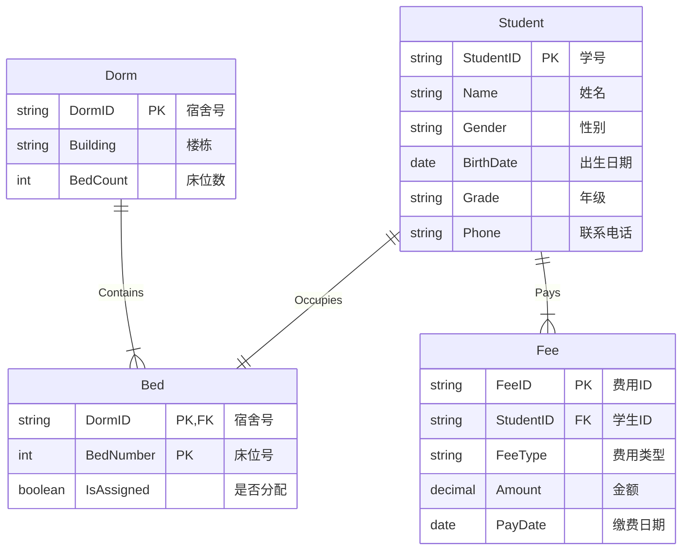

# 宿舍管理系统数据库设计报告

## 1. 概念结构设计 (E-R 图)

本系统主要用于学校宿舍管理，涉及的主要实体包括**学生 (Student)**、**宿舍 (Dorm)**、**床位 (Bed)** 和 **费用 (Fee)**。

### 1.1 实体与属性定义

1.  **学生 (Student)**
    *   **描述**: 住校的学生主体。
    *   **属性**: 学号 (StudentID, 主键)、姓名 (Name)、性别 (Gender)、出生日期 (BirthDate)、年级 (Grade)、联系电话 (Phone)。
2.  **宿舍 (Dorm)**
    *   **描述**: 宿舍楼中的房间单元。
    *   **属性**: 宿舍号 (DormID, 主键)、所属楼栋 (Building)、床位数 (BedCount)。
3.  **床位 (Bed)**
    *   **描述**: 宿舍内的具体床位，是学生入住的最小单元。床位是一个**弱实体**，它必须依赖于宿舍存在。
    *   **属性**: 床位号 (BedNumber)、是否已分配 (IsAssigned)。
    *   **标识符**: 由 (宿舍号, 床位号) 共同组成复合标识符。
4.  **费用 (Fee)**
    *   **描述**: 学生产生的相关费用记录。
    *   **属性**: 费用流水号 (FeeID, 主键)、费用类型 (FeeType)、金额 (Amount)、缴费日期 (PayDate)。

### 1.2 实体间联系

1.  **包含 (Contains)**
    *   **关联实体**: 宿舍 (1) —— 床位 (N)
    *   **描述**: 一个宿舍包含多个床位，一个床位只能属于一个宿舍。
    *   **联系类型**: 1:N (一对多)
2.  **入住 (Occupies)**
    *   **关联实体**: 学生 (1) —— 床位 (1)
    *   **描述**: 一个学生只能入住一个床位，一个床位同一时间只能分配给一个学生。
    *   **联系类型**: 1:1 (一对一)
3.  **缴纳 (Pays)**
    *   **关联实体**: 学生 (1) —— 费用 (N)
    *   **描述**: 一个学生可以有多笔费用记录（如住宿费、水电费），每一笔费用记录必须归属于一个学生。
    *   **联系类型**: 1:N (一对多)

### 1.3 E-R 图 (Mermaid 表示)

---

## 2. 数据字典

数据字典是数据库设计的重要文档，主要包含数据项、数据结构、数据存储、数据流和处理过程五个部分。

### 2.1 数据项 (Data Items)

数据项是数据库中最小的逻辑单位。

| 数据项名 | 含义说明 | 类型 | 长度 | 取值范围 | 所属数据结构 |
| :--- | :--- | :--- | :--- | :--- | :--- |
| StudentID | 学生学号 | VARCHAR | 20 | 唯一，非空 | 学生表 |
| Name | 学生姓名 | VARCHAR | 100 | 非空 | 学生表 |
| Gender | 性别 | CHAR | 1 | 'M'或'F' | 学生表 |
| DormID | 宿舍编号 | VARCHAR | 20 | 唯一，非空 | 宿舍表, 学生表, 床位表 |
| Building | 楼栋名称 | VARCHAR | 50 | - | 宿舍表 |
| BedNumber | 床位号码 | INT | 4 | 1-8 (通常) | 床位表, 学生表 |
| Amount | 费用金额 | DECIMAL | (10,2) | >= 0 | 费用表 |
| ... | ... | ... | ... | ... | ... |

### 2.2 数据结构 (Data Structures)

数据结构描述了数据项之间的组合关系（即表结构）。

*   **学生信息结构**: { StudentID, Name, Gender, BirthDate, Grade, DormID, BedNumber, Phone }
*   **宿舍信息结构**: { DormID, Building, BedCount }
*   **床位信息结构**: { DormID, BedNumber, IsAssigned, StudentID }
*   **费用信息结构**: { FeeID, StudentID, FeeType, Amount, PayDate }

### 2.3 数据存储 (Data Stores)

数据存储是数据结构在系统中的物理或逻辑存放处。

| 数据存储名 | 说明 | 组成 | 关键字 |
| :--- | :--- | :--- | :--- |
| D1_Student | 存放所有在校学生信息 | 学生信息结构 | StudentID |
| D2_Dorm | 存放宿舍楼及房间信息 | 宿舍信息结构 | DormID |
| D3_Bed | 存放床位及其状态信息 | 床位信息结构 | DormID + BedNumber |
| D4_Fee | 存放学生缴费及欠费记录 | 费用信息结构 | FeeID |

### 2.4 数据流 (Data Flows)

*简述系统主要数据流向：*

*   **F1 入住申请**: 学生信息 + 意向宿舍 -> 分配处理 -> 更新床位状态
*   **F2 退宿申请**: 学生ID -> 退宿处理 -> 清空床位状态
*   **F3 缴费单**: 费用信息 -> 录入处理 -> 保存至费用表

### 2.5 处理过程 (Processing Logic)

*   **P1 分配床位**: 输入学生ID和目标床位，检查床位 `IsAssigned` 是否为 `FALSE`。若是，则更新床位状态为 `TRUE`，写入 `StudentID`，并更新学生表的 `DormID` 和 `BedNumber`。
*   **P2 释放床位**: 根据学生ID找到对应床位，将床位 `IsAssigned` 置为 `FALSE`，清空 `StudentID`。

---

## 3. 逻辑结构设计

逻辑结构设计的任务是将 E-R 图转换为具体 DBMS 支持的数据模型（关系模型），并进行规范化。

### 3.1 E-R 图向关系模式的转换

根据转换规则：
1.  **实体转换**:
    *   Student 转换为 **Student 关系**。
    *   Dorm 转换为 **Dorm 关系**。
    *   Fee 转换为 **Fee 关系**。
2.  **联系转换**:
    *   **Student 与 Bed (1:1)**: 可以将 Bed 合并到 Student，或者将 Student 的主键加入 Bed，或者将 Bed 的主键加入 Student。考虑到查询便利性，我们采用了**双向关联**（冗余设计），即在 Student 中存储 (DormID, BedNumber)，在 Bed 中存储 StudentID。这虽然引入了少量冗余，但极大地提高了“查人找床”和“查床找人”的效率。
    *   **Dorm 与 Bed (1:N)**: Bed 是弱实体，其主键必须包含 Dorm 的主键。因此 Bed 的主键设计为 (DormID, BedNumber)。
    *   **Student 与 Fee (1:N)**: 在 N 端（Fee）加入 1 端（Student）的主键作为外键。

### 3.2 关系模式定义

最终得到以下关系模式：

1.  **Student** (<u>StudentID</u>, Name, Gender, BirthDate, Grade, Phone, *DormID*, *BedNumber*)
    *   主键: StudentID
    *   外键: (DormID, BedNumber) 参照 Bed 表
2.  **Dorm** (<u>DormID</u>, Building, BedCount)
    *   主键: DormID
3.  **Bed** (<u>*DormID*, BedNumber</u>, IsAssigned, *StudentID*)
    *   主键: (DormID, BedNumber) 复合主键
    *   外键: DormID 参照 Dorm 表
    *   外键: StudentID 参照 Student 表
4.  **Fee** (<u>FeeID</u>, *StudentID*, FeeType, Amount, PayDate)
    *   主键: FeeID
    *   外键: StudentID 参照 Student 表

### 3.3 规范化与优化分析

*   **表数量分析**: 系统最少需要 3 个表（如果将 Bed 信息完全合并入 Dorm 或 Student），但这样无法独立管理床位状态（例如空床位）。为了清晰管理“空床位”这一资源，必须独立设计 **Bed** 表。因此 4 个表是合理的。
*   **范式分析**:
    *   所有属性均为原子值，满足 **1NF**。
    *   主键均为唯一标识，非主属性完全依赖于主键，满足 **2NF**。
    *   不存在非主属性对主键的传递依赖（例如，Fee 表中 FeeType 直接依赖于 FeeID，不依赖于 StudentID），满足 **3NF**。
*   **优化**: 在 Student 表中冗余存储 DormID 和 BedNumber，是为了在展示学生列表时，无需频繁 Join Bed 表即可直接显示其住宿位置，属于典型的“以空间换时间”的优化策略。

---

## 4. 物理结构设计

物理设计是为逻辑数据模型选取一个最适合应用环境的物理结构（包括存储结构和存取方法）。

### 4.1 存储结构设计

本系统采用 MySQL 数据库，默认存储引擎为 **InnoDB**。

1.  **存储引擎选择**:
    *   **InnoDB**: 支持事务（ACID）、行级锁和外键约束。由于宿舍分配涉及学生状态和床位状态的同步更新（原子性操作），必须使用支持事务的引擎。
2.  **字符集**:
    *   **utf8mb4**: 支持存储中文字符及特殊符号（如 Emoji），排序规则采用 `utf8mb4_general_ci`。

### 4.2 存取方法设计 (索引设计)

为了提高查询效率，根据 textbook 第七章的原则，设计如下索引：

1.  **聚簇索引 (Clustered Index)**:
    *   所有表的主键（PRIMARY KEY）自动建立聚簇索引。数据在物理上按主键顺序存储，基于主键的查询（如 `SELECT * FROM Student WHERE StudentID = '...'`）速度最快。
2.  **辅助索引 (Secondary Indexes)**:
    *   **外键索引**: MySQL 自动为外键列创建索引。
        *   `Bed(DormID)`: 加速“查询某宿舍所有床位”的操作。
        *   `Fee(StudentID)`: 加速“查询某学生所有缴费记录”的操作。
        *   `Student(DormID)`: 加速“查询某宿舍住了哪些学生”的操作。
    *   **业务查询索引**:
        *   若经常按“姓名”查询学生，建议在 `Student(Name)` 上建立普通索引。
        *   若经常按“年级”统计，建议在 `Student(Grade)` 上建立索引。

### 4.3 物理文件组织

*   数据文件与索引文件通常存储在 `.ibd` 文件中（在使用 `innodb_file_per_table` 配置下），每个表对应一个物理文件，便于管理和空间回收。

